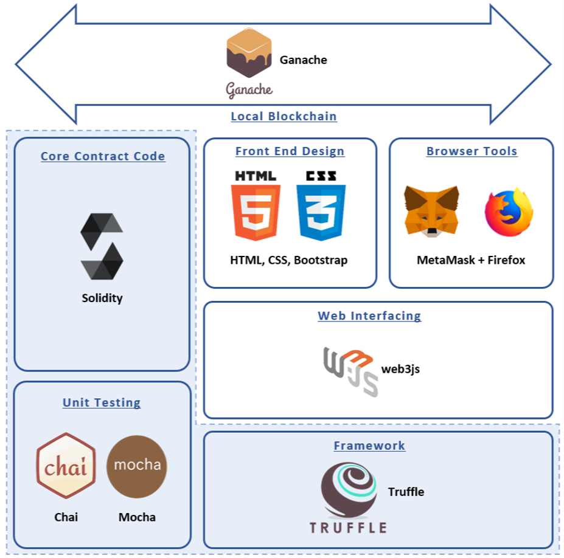

# EFSS
The idea is to build decentralized encrypted file sharing system using Blockchain (IPFS | GPG/PGP | Truffle Suite | Ganache | Solidity | JS | React | RSA)


<p align="center">

</p>

## Setup

1. Clone Repository

    ```sh
    $ git clone https://github.com/Vib-UX/EFSS.git
    $ cd EFSS
    ```

2. Install Dependencies

    ```sh
    $ npm install
    ```

3. Run Dapp

    ```sh
    $ npm run start
    ```

    Browser will launch on [http://localhost:3000/](http://localhost:3000/).
    Eureka!


## Tools and Technology used 

<p align="center">

</p>
	


## Working SS

<p align="center">
Demonstration of the working result :
</p>

<p align="center">

</p>


## Contribute

This dapp is a free, open source and censorship resistant.


